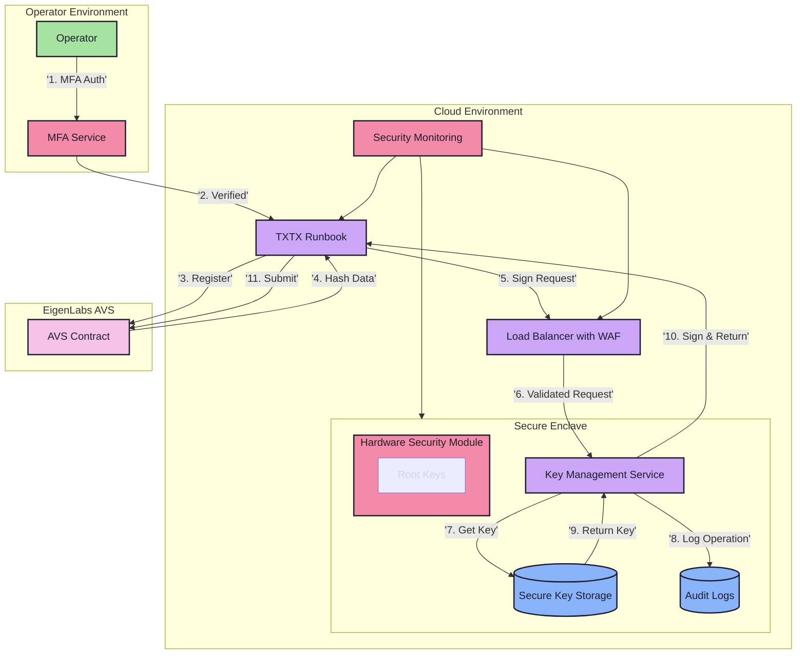

# Future Considerations

## Overview

This document outlines the security roadmap and future enhancements for the Key Management Service, including:
- Security audit findings
- Implementation roadmap
- Scalability considerations
- Technical terminology

## Security Audit

### Critical Recommendations

#### Access Control
- Implement strong mutual TLS (mTLS)
- Add rate limiting for API endpoints
- Require multi-factor authentication
- Implement role-based access control (RBAC)
- Add IP allowlisting

#### Key Management
- Implement key usage limits
- Add entropy monitoring
- Implement secure key deletion
- Add HSM support
- Implement key backup procedures
- Add version control for metadata

#### Secure Enclave
- Regular security patches
- Implement secure boot
- Add runtime integrity monitoring
- Implement memory encryption
- Add secure audit logging
- Implement secure error handling

#### Monitoring
- Real-time alerting
- Automated response procedures
- Comprehensive audit logging
- Incident response playbooks
- Automated backup verification
- Regular security scanning

#### Compliance
- Align with NIST SP 800-57
- Implement FIPS 140-3 compliance
- Add regulatory reporting
- Create key ceremony procedures
- Implement secure key destruction

## Enhanced Architecture

## Risk Assessment

| Risk Category | Threat | Impact | Mitigation |
|--------------|--------|---------|------------|
| Key Exposure | Unauthorized access | Critical | HSM, secure enclave |
| Service Availability | DoS attacks | High | Rate limiting, WAF |
| Authentication | Impersonation | Critical | MFA, mTLS |
| Data Integrity | Tampering | High | Audit logging |
| Compliance | Regulatory violations | High | Standards alignment |

## Implementation Roadmap

### Phase 1: Critical Security
- HSM integration
- Comprehensive audit logging
- MFA implementation
- mTLS deployment

### Phase 2: High Priority
- WAF and rate limiting
- Automated monitoring
- Incident response
- Key backup procedures

### Phase 3: Operational
- Compliance documentation
- Key ceremony procedures
- Geographic redundancy
- Security guidelines

## Scalability

### Multi-Region Support
- Geographical distribution
- Region-specific compliance
- Cross-region synchronization

### Enterprise Features
- Multi-tenant support
- Custom key rotation
- Identity provider integration
- Advanced analytics

### Automation
- Automated deployment
- CI/CD security
- Infrastructure as Code
- Security testing

### Ecosystem
- Additional AVS support
- Standardized API
- Security module plugins

## Glossary

### Security Components

#### HSM (Hardware Security Module)
- Physical device for key management
- Tamper-evident protection
- FIPS 140-2/3 certified
- Root key storage

#### mTLS (Mutual Transport Layer Security)
- Two-way authentication
- Certificate-based identity
- Man-in-the-middle protection
- Secure service communication

#### WAF (Web Application Firewall)
- HTTP/HTTPS traffic filtering
- Common attack protection
- Rate limiting
- Security monitoring

### Technical Terms

#### RBAC (Role-Based Access Control)
- Role-based permissions
- Granular access management
- Organizational security

#### DDoS (Distributed Denial of Service)
- Traffic-based attacks
- WAF protection
- Rate limiting

#### FIPS (Federal Information Processing Standards)
- US government standards
- Cryptographic security
- FIPS 140-3 compliance

#### MPC (Multi-Party Computation)
- Distributed computation
- Secure input handling
- Key generation

## Related Documentation
- [Key Management Service](KeyManagement.md)
- [API Reference](../src/web/README.md)
- [BN254 Library](../README.md) 