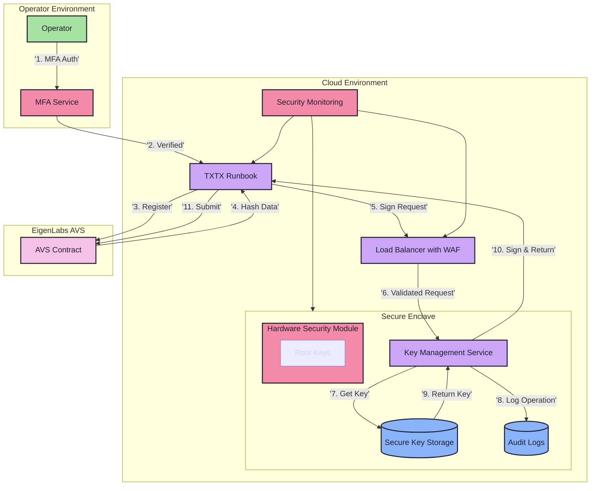

# Future Considerations for Key Management Service

This document outlines security audit findings and future considerations for enhancing the Key Management Service.

## Security Audit Considerations

### Critical Security Recommendations

1. **Access Control and Authentication**
   - Implement strong mutual TLS (mTLS) between all service components
   - Add rate limiting for all API endpoints to prevent DoS attacks
   - Require multi-factor authentication for operator access
   - Implement role-based access control (RBAC) for administrative functions
   - Add IP allowlisting for operator connections

2. **Key Management Hardening**
   - Implement key usage limits and automatic rotation triggers
   - Add entropy monitoring during key generation
   - Implement secure key deletion procedures with verification
   - Add hardware security module (HSM) support for root keys
   - Implement key backup procedures with geographical distribution
   - Add version control for key metadata

3. **Secure Enclave Enhancement**
   - Regular security patches and updates policy
   - Implement secure boot and attestation
   - Add runtime integrity monitoring
   - Implement memory encryption for all key material
   - Add secure audit logging for all key operations
   - Implement secure error handling to prevent information leakage

4. **Monitoring and Incident Response**
   - Add real-time alerting for suspicious activities
   - Implement automated response procedures for potential breaches
   - Add comprehensive audit logging with tamper detection
   - Create incident response playbooks
   - Implement automated backup verification
   - Add regular security scanning and penetration testing procedures

5. **Compliance and Standards**
   - Align with NIST SP 800-57 key management guidelines
   - Implement FIPS 140-3 compliance where applicable
   - Add support for regulatory reporting requirements
   - Create key ceremony procedures and documentation
   - Implement secure key destruction procedures meeting regulatory requirements

## Enhanced Security Architecture

## Risk Assessment Matrix

| Risk Category | Threat | Impact | Mitigation |
|--------------|--------|---------|------------|
| Key Exposure | Unauthorized access to private keys | Critical | HSM, secure enclave, access controls |
| Service Availability | DoS attacks | High | Rate limiting, load balancing, monitoring |
| Authentication | Impersonation attacks | Critical | MFA, mTLS, IP allowlisting |
| Data Integrity | Tampering with key metadata | High | Audit logging, integrity monitoring |
| Compliance | Regulatory violations | High | Standards alignment, documentation |

## Implementation Roadmap

### Phase 1 - Critical Security Features
- Implement HSM integration for root key protection
- Add comprehensive audit logging
- Deploy MFA for all operator access
- Implement mTLS between all components

### Phase 2 - High Priority Enhancements
- Deploy WAF and rate limiting
- Implement automated monitoring
- Create incident response procedures
- Add key backup procedures

### Phase 3 - Operational Improvements
- Develop compliance documentation
- Implement key ceremony procedures
- Add geographic redundancy
- Create operator security guidelines

## Future Scalability Considerations

1. **Multi-Region Support**
   - Geographical distribution of key storage
   - Region-specific compliance handling
   - Cross-region synchronization

2. **Enterprise Features**
   - Multi-tenant support
   - Custom key rotation policies
   - Integration with enterprise identity providers
   - Advanced reporting and analytics

3. **Automation and DevOps**
   - Automated deployment procedures
   - CI/CD pipeline security
   - Infrastructure as Code templates
   - Automated security testing

4. **Ecosystem Integration**
   - Support for additional AVS providers
   - Standardized API for third-party integration
   - Plugin system for custom security modules

## Glossary

### Security Components and Protocols

- **HSM (Hardware Security Module)**
  - A physical computing device that safeguards and manages digital keys
  - Provides tamper-evident, tamper-resistant protection for cryptographic operations
  - Typically FIPS 140-2/3 certified for high-security environments
  - Used for storing root keys and performing critical cryptographic operations

- **mTLS (Mutual Transport Layer Security)**
  - Enhanced version of TLS where both client and server authenticate each other
  - Both parties present digital certificates to prove their identity
  - Prevents man-in-the-middle attacks and unauthorized service access
  - Essential for secure service-to-service communication

- **WAF (Web Application Firewall)**
  - Security tool that filters and monitors HTTP/HTTPS traffic
  - Protects web applications from common attacks like SQL injection, XSS
  - Can implement rate limiting and DDoS protection
  - Provides real-time security monitoring and alerting

### Other Technical Terms

- **RBAC (Role-Based Access Control)**
  - Security model that restricts system access based on roles
  - Enables granular permission management
  - Simplifies access management for large organizations

- **DDoS (Distributed Denial of Service)**
  - Attack that attempts to overwhelm services with traffic
  - Mitigated through rate limiting and WAF protection

- **FIPS (Federal Information Processing Standards)**
  - U.S. government security standards for cryptographic modules
  - FIPS 140-3 is the current standard for cryptographic security

- **MPC (Multi-Party Computation)**
  - Cryptographic technique allowing multiple parties to compute together
  - Enables secure computation without revealing individual inputs
  - Used for distributed key generation and management 