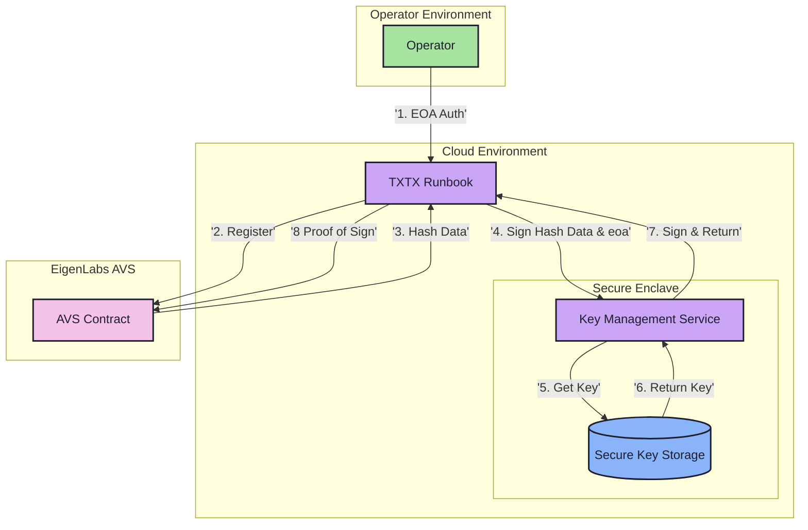

# Key Management Service for EigenLabs AVS Operators

## Overview

This document outlines the rationale and implementation details for a key management service designed to address security and operational challenges in the EigenLabs AVS (Actively Validated Services) ecosystem. A key focus is enabling seamless key rotation capabilities to enhance operator experience and security posture.

## System Architecture



## Problem Statement

The current EigenLabs operator-set requirements necessitate that AVS operators create, manage, and use BN254 keys for onboarding. This presents several challenges:

1. **Operational Complexity**: Each operator must independently manage their cryptographic keys
2. **Security Risks**: Multiple AVS operators handling their own keys creates potential security vulnerabilities
3. **Scalability Issues**: As operators support multiple AVS sets, each with different key management flows, the complexity and risk increase
4. **Future-Proofing**: BN254 curve offers only 100 bits of security, making it unsuitable for long-term cryptographic security requirements
5. **Key Rotation Challenges**: Without a centralized key management system, operators lack the ability to easily rotate keys across multiple AVS services

## Solution Architecture

The proposed solution abstracts key storage and signing capabilities into a web service that:
- Handles key creation and management securely
- Provides a standardized API for signing operations
- Eliminates the need for operators to manage private keys directly

### Implementation Details

The service will be implemented as a web service with the following core functionalities:

```typescript
interface KeyManagementService {
    // Create a new BLS key for an operator and store it securely
    // Note: The generated key pair is stored in the secure enclave and never exposed to the user
    createKey(eoa: string): Promise<void>;
    
    // Perform scalar multiplication for signing
    // Note: Only public data (hash) is provided, private key operations happen in secure enclave
    scalar_mul(
        eoa: string, 
        hash: G1Point
    ): Promise<{
        signature: G1Point,  // (eoa_pk * hash) as G1Point
        g1: G1Point,        // eoa_g1
        g2: G2Point         // eoa_g2
    }>;
}
```

### Key Storage and Security

The service implements a strict security model where:
- Generated key pairs are immediately stored in a secure enclave
- Private keys are never exposed outside the secure environment
- Only public data (hashes) is accepted for signing operations
- All cryptographic operations are performed within the secure enclave
- The `createKey` function returns void as the key pair is managed internally
- Key rotation is handled seamlessly within the secure environment

> **Note on Future Requirements**: While this spike focuses on secure key generation and signing operations, a future enhancement will need to address secure key delivery to operators. This would involve implementing a secure mechanism for operators to access their keys when needed, potentially through encrypted channels or secure hardware modules. This key delivery mechanism is explicitly out of scope for the current spike.

### Future Enhancements

The architecture is designed to support future upgrades:
- Integration with MPC (Multi-Party Computation) for enhanced security
- Secure enclave storage for private keys
- Migration to more secure curves as cryptographic requirements evolve
- **Key Rotation Capabilities**:
  - Automated key rotation schedules
  - Graceful transition periods between old and new keys
  - Concurrent support for multiple active keys during rotation
  - Automated updates of AVS registrations with new keys
  - Monitoring and alerting for key rotation events
  - Audit trail of key rotations for compliance and security

## DIN Implementation for Testnet 0.2

For the ephemeral testnet 0.2, DIN will:
1. Host TXTX runbooks and the key management web service in a cloud environment
2. Provide operators with access to the cloud VM for onboarding and slashing tests
3. Enable TXTX to perform signing operations through the local web service
4. Maintain operator EOA verification as part of the standard runbook workflow

## Security Considerations

- Private keys never leave the secure enclave
- All signing operations are performed within the secure environment
- Operator authentication is maintained through EOA verification
- The service can be upgraded to use more secure curves as needed
