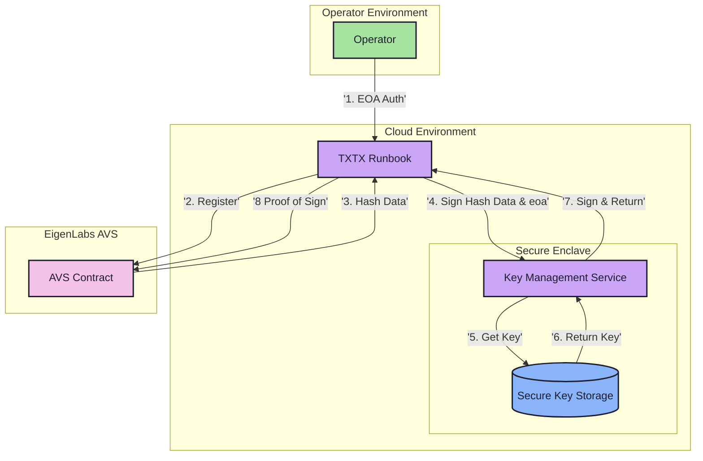

# Key Management Service

## Overview

The Key Management Service is a secure component designed for EigenLabs AVS operators, providing:
- Secure key generation and storage
- Signing operations within a secure enclave
- EOA-based authentication
- Seamless key rotation capabilities

## Architecture

### System Components



### Component Roles
- **Operator Environment**: User interface and authentication
- **Cloud Environment**: Hosts TXTX runbooks and secure enclave
- **Secure Enclave**: Protected environment for key operations
- **EigenLabs AVS**: On-chain contract interactions

## Implementation

### Core Functionality

```typescript
interface KeyManagementService {
    // Create a new BLS key for an operator and store it securely
    // Note: The generated key pair is stored in the secure enclave and never exposed to the user
    createKey(eoa: string): Promise<void>;
    
    // Perform scalar multiplication for signing
    // Note: Only public data (hash) is provided, private key operations happen in secure enclave
    scalar_mul(
        eoa: string, 
        hash: G1Point
    ): Promise<{
        signature: G1Point,  // (eoa_pk * hash) as G1Point
        g1: G1Point,        // eoa_g1
        g2: G2Point         // eoa_g2
    }>;
}
```

### Security Model
- Generated key pairs stored in secure enclave
- Private keys never exposed outside secure environment
- Only public data (hashes) accepted for signing
- All cryptographic operations in secure enclave
- Key rotation handled within secure environment

## Current Implementation

### DIN Implementation for Testnet 0.2
1. Host TXTX runbooks and key management service in cloud
2. Provide operator access to cloud VM for onboarding
3. Enable TXTX signing through local web service
4. Maintain EOA verification in runbook workflow

### Security Features
- Private keys never leave secure enclave
- All signing operations in secure environment
- Operator authentication via EOA verification
- Upgradeable to more secure curves

## Future Enhancements

### Key Rotation
- Automated rotation schedules
- Graceful transition periods
- Multiple active key support
- Automated AVS registration updates
- Rotation monitoring and alerts
- Audit trail maintenance

### Security Upgrades
See [Future Considerations](FutureConsiderations.md) for detailed security roadmap.

## Related Documentation
- [API Reference](../src/web/README.md)
- [Security Roadmap](FutureConsiderations.md)
- [BN254 Library](../README.md)
