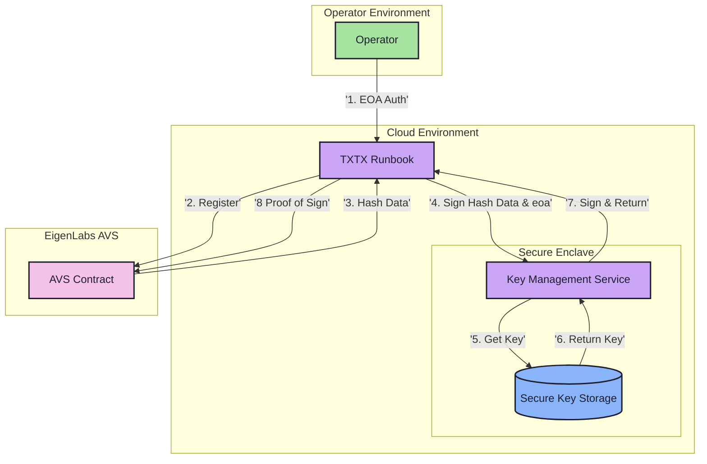

# Key Management Service

## Overview

The Key Management Service is a proof-of-concept component designed for EigenLabs AVS operators, establishing a foundation for security through separation of concerns:
- Key storage and management isolated from other system components
- Signing operations performed in a dedicated service
- Architecture that enables future security enhancements

Note: This implementation does NOT provide production-level security guarantees. It demonstrates the necessary separation of concerns that would be required in a properly secured key management system.

## Architecture

### System Components



### Component Roles
- **Operator Environment**: User interface and authentication
- **Cloud Environment**: Hosts TXTX runbooks and secure enclave
- **Secure Enclave**: Protected environment for key operations
- **EigenLabs AVS**: On-chain contract interactions

## Implementation

### Core Functionality

```typescript
interface KeyManagementService {
    // Perform scalar multiplication for signing
    // Note: Only public data (hash) is provided, private key operations happen in secure enclave
    scalar_mul(
        eoa: string, 
        hash: G1Point
    ): Promise<{
        signature: G1Point,  // (eoa_pk * hash) as G1Point
        g1: G1Point,        // eoa_g1
        g2: G2Point         // eoa_g2
    }>;
}
```

### Security Model
- Private keys never exposed outside web-server (separation of concerns, not production security)
- Only public data (hashes) accepted for signing (foundation for secure design)
- All cryptographic operations in web-server (architectural pattern for future security hardening)
- Note: This design establishes separation of concerns that would allow for a secure KMS to be built on top, but does not provide production-level security guarantees

## Current Implementation

### DIN Implementation for Testnet 0.2
1. Host TXTX runbooks and key management service in cloud
2. Provide operator access to cloud VM for onboarding
3. Enable TXTX signing through local web service
4. Maintain EOA verification in runbook workflow

### Addressing a technical debt through better architecture
- The separation of concerns pattern enables a smoother upgrade path when EigenLayer transitions from BN254 to a more secure curve
- Key management logic remains isolated from curve-specific implementations
- Operators can maintain the same workflow while underlying cryptography evolves
- Minimizes disruption during security upgrades
- Allows for parallel support of multiple curves during transition periods

## Future Enhancements

### Key Rotation
- Automated rotation schedules
- Graceful transition periods
- Multiple active key support
- Automated AVS registration updates
- Rotation monitoring and alerts
- Audit trail maintenance

### Security Upgrades
See [Future Considerations](FutureConsiderations.md) for detailed security roadmap.

## Related Documentation
- [API Reference](../src/web/README.md)
- [Security Roadmap](FutureConsiderations.md)
- [BN254 Library](../README.md)
